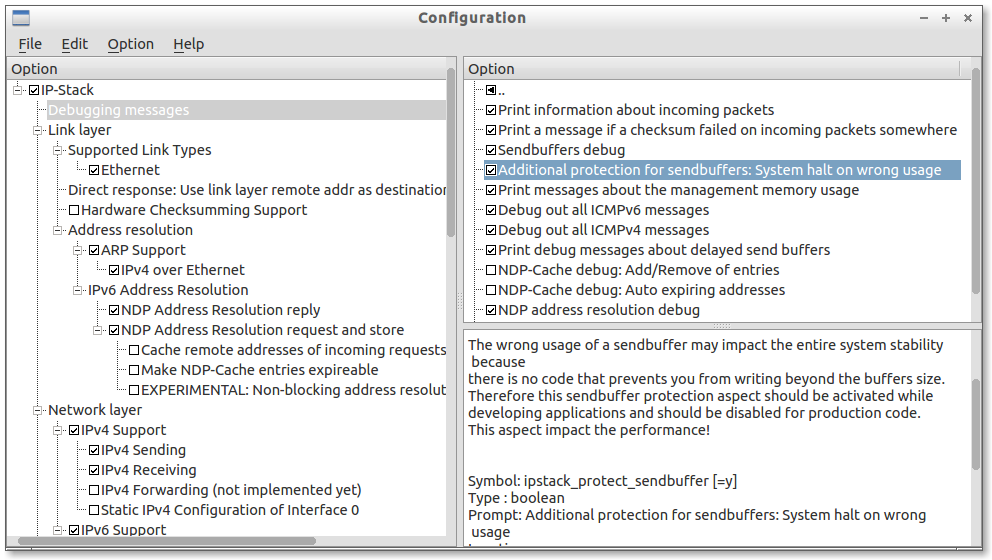
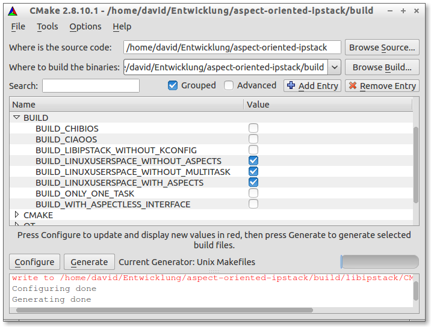

Aspect oriented IPstack for embedded systems
============================================

> A **highly configurable** and easily extendable TCP/IP-Stack with IPv4, IPv6, UDP, TCP, ICMPv4, ICMPv6 support.
This network stack is written in C++/AspectC++ and because it is build and designed around the idea of aspects,
you may select your desired functionallity during build time in a very fine grained way and on the same time
the code retains maintainability.

The *Aspect-IP-Stack* is plattform agnostic and supports little and big endian systems. It has been tested
on `x86 32-bit`/`x86 64-bit` as well as `arm 32-bit`, `msp430 16-bit` and `avr 8-bit` processors
([Supported Platforms](doc/supported_platforms.md)).

There are two examples of integrating the IP-Stack into operating systems for embedded systems (CiAO-OS and Chibi-OS)
and another example of using it as a linux userspace application on a tun-device. The last one allows us to easily
debug and measure the code and using test-driven development for an efficient and correct implementation.

If you already use the CMake buildsystem, integrating the IP-Stack is very easy and explained
[here](doc/include_in_cmake_based_project.md). Use application aspects for easily interfere and
modify the ipstack without having explicit APIs to all and every function of this software.

If you do not use CMake nor AspectC++ in your project you still have the option of building a
static library with a plain [**C++** / **C**](doc/aspectless_integration_api.md) Integration API
for using TCP and UDP sockets on IPv4/IPv6.
You find well documented examples in the linux userspace integration directory.

> Please use the ticket system of github for bugs and feature suggestions.

Work in progress (September 2013):
-------------------------------
This software is **NOT USABLE** in its current state. TODO:
- Add linux userspace ipstack support via raw sockets or tun device.
- Add API for non-multitasking support
- Add API for management sockets in own task.
- Add build system parts for adding own aspects outside of the libipstack/src directory.
- Add documentation papers to /doc (e.g. APIs, example step-by-step).

Features
========
* Highly configurable at build time
* BSD-like (event based) [sockets API](doc/socket_api.md)
* Own memory management for ressource restricted systems. We not not use the heap in the default configuration.
* Only thin interface to your OS/APP has to be provided, IRQ/Multitask safe

<table>
<thead>
  <tr><th>Link-Layer</th><th>IP-Layer</th><th>Transport-Layer</th></tr>
</thead>
<tbody>
  <tr valign="top"><td>
  <ul>
    <li>Ethernet</li>
    <li>IPv4 ARP (Address resolution protocol)</li>
  </ul>
  </td>
  <td>
    <ul>
    <li>Singlestack or Dualstack IPv4/IPv6</li>
    <li>ICMPv4/v6 info/error messages (ping, etc)</li>
    <li>IPv6 NDP<ul>
      <li>Address resolution</li>
      <li>Address duplication check</li>
      <li>Router discovery</li>
      <li>Autoconfiguration</li>
      </ul>
    </li>
    <li>MLD (Multicast Listener Discovery) v1/v2</li>
    </ul>

  </td>
  <td>
    <ul>
    <li>UDP</li>
    <li>TCP
      <ul>
      <li>Sliding Window</li>
      <li>Avoid Silly Window Syndrome</li>
      <li>Round-Trip Time Estimation</li>
      <li>Congestion Control</li>
      <li>MSS</li>
      </ul>
    </li>
    </ul>
  </td></tr>
</tbody>
</table>

Configure to your needs
=======================
The configuration of this software is done by the kconfig tool, developted and used by the linux-kernel community.
We're using a slightly modified version, the __kconfig-frontends__ packet (http://ymorin.is-a-geek.org/projects/kconfig-frontends).

Building and execution of kconfig is integrated into the cmake buildsystem. It is even prepared for the case that
you already using kconfig for your os or application.

Building: With/Without Aspect-oriented integration
==================================================
After building this software you have a static library that either has the integration with your
app/os weaved in via aspects (see [_Aspect-oriented integration_](doc/aspect_integration_api.md))
or provides a [**C++** / **C** Integration](doc/aspectless_integration_api.md) API.
You may obtain CMake for configuring the buildsystem at http://www.cmake.org.
Additionally you need the aspectc++ compiler from http://www.aspectc.org.
We only explain the graphical way of configuring the build system (`cmake-gui`), but you may also use
the command line version.
* Create a directory called "build" (or any other name).
* Start cmake-gui and select the top directory as source and the "build" directory as build directory.
* Click __"configure"__.
* A popup will appear and ask for the target build system.
  We assume you are using `make` for buildsystem project files.

You will be presented with some build options.
* __"BUILD_ONLY_ONE_TASK"__ will disable multitask support and is discussed in the section below.
* __"BUILD_WITH_ASPECTLESS_INTERFACE"__ will provide the pure,
aspectless [**C++** / **C** Integration](doc/aspectless_integration_api.md) API.

If you are done with configuring the buildsystem click on __"generate"__. Depending on your selection in the first
popup you have VisualStudio project files, make files or something else in your build directory.
* Change to your build directory.
* Execute `make`. This will download and build the kconfig-frontend and automatically open the configuration editor.
* Configure the ipstack to your needs. Close the editor and save the changes.
* Execute `make` again to build the examples if selected and the libipstack library.

If you want to reconfigure libipstack do this:
* Change to your build directory.
* Execute `make reconfigure`. This will open the configuration editor.
* Configure the ipstack to your needs. Close the editor and save the changes.
* Execute `make` again to build the examples if selected and the libipstack library.

About multitasking support
--------------------------
The ipstack is designed for multitasking systems. Usually there exists the system task
where interaction with the hardware takes place and traffic is received. The second 
the user task where traffic is generated and consumed. Places where tasks are used:
For example we do some busy-waiting while waiting for an arp or IPv6 neighbour response and for timing
tcp traffic etc. Check out the CiAO-OS integration as an example: We reschedule before entering a busy
loop to allow for a better usage of the remaining waiting time. We use the alarm/event support of the
operating system to make the task sleep while waiting for the next packet or tcp timeout.

But we realize that on some very restricted systems multitasking support costs valuable space or uses limited ressources like timers.
We therefore provide the __"BUILD_ONLY_ONE_TASK"__ cmake option. What it does is:
* Adding an _IP::periodic()_ method that has to be called periodically from your main loop.
* You need to check reachability before sending with _IP::is_reachable(addr)_ because we no longer blocking the "application-task" while resolving link layer (e.g. ethernet) addresses.

Example: Look at `integration/linux_userspace_without_aspects_multitask`.

Integrate in your buildsystem
=============================
If your buildsystem is CMake based you just need to use `add_subdirectory(aspect-oriented-ipstack)` and make
your target depends on `libipstack`. Futher information can be found [here](doc/include_in_cmake_based_project.md).
This allows you to use aspects to weave in more complex integration like
using network cards capability of calculating checksums etc.
For other buildsystems you may prebuild the static library and just use it with the
aspectless [**C++** / **C** Integration](doc/aspectless_integration_api.md) API.

Examples
========
We provide some example applications and example integrations.
The applications aren't executable on their own without an integration.

Example applications
--------------------
__http_simple_server:__ Provides a very simple http server. Only one page
is returned and the http headers and content are statically compiled in.

__icmp_test:__ Only the ip management subsystem is enabled.
This application is for testing ICMPv4/v6, udp send/receive, tcp reset.
> You can ping by using:
> * ping 10.0.3.2 (for icmp ping, substitue with your configured IP)
> * ping6 fe80::6655:44ff:fe33:2211%tap0 (for icmp ping with ipv6 on tap0 device)
> * echoping -u 10.0.3.2 (for udp ping; use ipv4 addresses, ipv6 is not supported by echoping for udp)
> * sendip -p ipv6 -p udp -us 5070 -ud 7 -d "Hello" -v fe80::6655:44ff:fe33:2211 (for ipv6 udp ping)
> * telnet 10.0.3.2 (for testing the tcp reset capability; use ipv4 or ipv6 address)
> * Send udp to port 88 to get it printed out
> 
> For full network interaction
> * activate ipv6 forwarding: sysctl -w net.ipv6.conf.all.forwarding=1
> * have an ipv6 capable router (or the "radvd" software)

__tcp_speedtest:__ This application is for testing the TCP Speed.
> It is in one of three states:
> * listening for a command 
> * receiving a predetermined amount of data as fast as possible
> * sending a predetermined amount of data as fast as possible
> 
> It opens a tcp listen socket on port 1234 and starts in the listen-for-a-command state. Commands:
> * "LISTEN": The application sends back "OK"  and is ready to receive 1024*1024*100 Bytes (100 MByte)
> 	of data without further interpretation.
> * "SEND": The application begins immediatelly to send 1024*1024*100 Bytes (100 MByte) of random data.
> 
> In the directory "linux_host_program" is a linux host program located for measuring tcp performance.
> Usage: _speedtest 10.0.3.2 1234 LISTEN_ or _speedtest 10.0.3.2 1234 SEND_.

__telnet:__ Use the telnet application to test this example. An echo to every
message is returned.

Example integrations
--------------------
__linux_userspace_with_aspects:__ In this example we're using aspects to tie
the ipstack and the linux tun device together. Two threads are initialized.
One is for receiving traffic and feeding the ipstack buffers and the other one
is for the application for generating and consuming traffic. All application
examples from above can be used with this type of integration.

__linux_userspace_without_aspects:__ The same as above, but the application
example, tun-device and threads are tied together without aspects. This example
demonstrates how to compile the ipstack as a standalone static lib that can
be used from outside by just using the api methods.

__linux_userspace_without_aspects_multitask:__ This example demonstrates the usage
of the ip-stack without using a multitask system. The main loop is responsible for
routing incoming and outgoing traffic to and from the ipstack and at the same time
provide the application layer. We show how to use the IP::periodic() and
IP::is_reachable(...) methods.

__ciao_os:__ The ipstack originated as a research project and extension of the
CiAO operating system for embedded systems. Therefore
support and maintainance are best for this integration. CiAO implements AutoSar
Events and Alarms and is multitasking capable. Usually there exists the system task
where traffic is received and the user task where traffic is generated and consumed.
The integration features IRQ-safeness, reschedules instead of inefficent waits and
task sleep if waiting for a packet.

**chibi_os**: To showcase the ability of integrating this piece of software into
another system, we decided to extend chibi os by another ip-stack.
Efficient multitasking support is implemented and the provided network drivers are used
for an [Arm 32Bit ENC28J60](doc/supported_platforms.md) based test board.

Collaborate
===========
To understand the project structure we provide some documentation as markdown readme files
within the code tree and in the `doc` directory. A good starting point is [here](doc/collaborate_index.md).
We tried to organize source files in an intuitive manner, if you're looking for a detail of the IPv4
implementation your first try should be the `ipv4` subdir. Design decisions are mainly explained in the
research papers linked at the bottom of this text (in german). The best way to collaborate 
is to use github via forks and the issue tracker.

License
=======
The buildsystem, example and integration code is licensed under the terms of the BSL 2-clause license.
The ipstack source code is GPL3 licensed. Please be aware of the implication: Because this software
is usally build as static library, your code have to be GPL3 compatible code.

Authors
=======
This software originated as a research project at the [University of Dortmund, Germany](http://www.tu-dortmund.de)
and has been created mainly by Christoph Borchert and David Gräff.
* [Entwicklung eines aspektorientierten TCP/IP-Stacks für eingebettete Systeme](http://ess.cs.tu-dortmund.de/Teaching/Theses/2010/DA_Borchert_2010.pdf)
* [IPv6: Aspektorientierte Erweiterung eines Netzwerkprotokoll-Stacks für eingebettete Systeme](http://ess.cs.tu-dortmund.de/Teaching/Theses/2012/BA_Graeff_2012.pdf)
* [CiAO/IP: a highly configurable aspect-oriented IP stack](http://faculty.pucit.edu.pk/fawaz/cs533/lectures/smartphone/p435-borchert.pdf)
