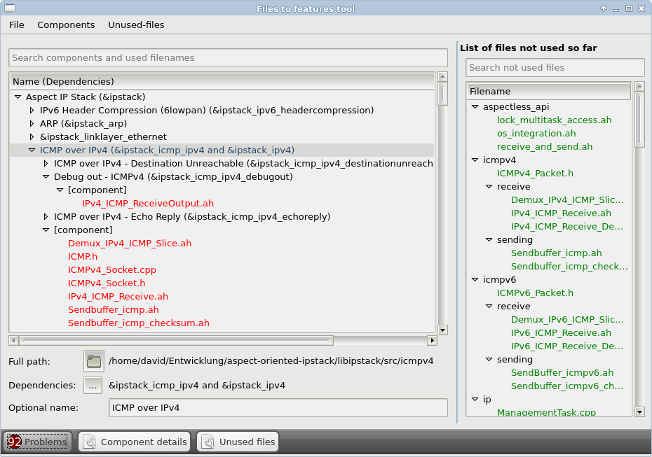
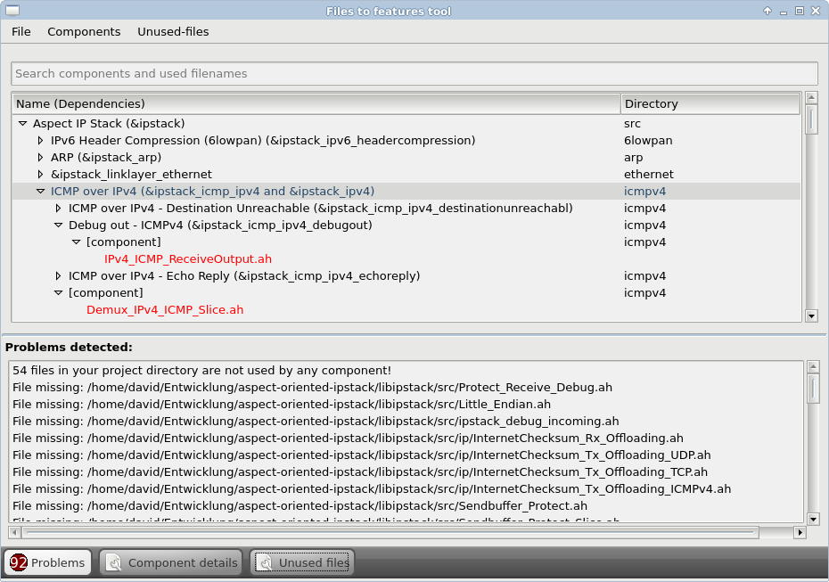

Collaborate
===========
[back](../readme.md)

## Feature Model
As you already know we use kconfig for feature selection. kconfig uses the
[kconfig language](https://www.kernel.org/doc/Documentation/kbuild/kconfig-language.txt)
for describing features and dependecies. If you want to add/modify features,
you start by editing this **feature model** file.

> Related file: `libipstack/buildsystem/ipstack.fm`

## Add/remove/move files
The buildsystem have to know which files belong to a feature. We do this by
using a so called **family model**. This is a json formatted file that
basically list all project files and their **feature model** dependecies.
The family models file syntax is explained in [Family Model](readme_familymodel.md).

We provide a convienent graphical editor to edit the **family model**,
detect missing/moved files and add newly created files to new or existing
components. Be aware that the editor is only build if your system provides
a working Qt5 installation and a c++11 capable compiler.

You can start the editor by using `make fix_files_to_features` manually. It
is also invoked if missing files or new files are detected.

You can add unused-files to a component by just using simple drag&drop from the
right files-tree to the left component-tree. You may assign components an optional name,
dependecies and a sub-directory. A component may only contain filenames relative to its
assigned directory.

> Related file: `libipstack/buildsystem/ipstack.json`